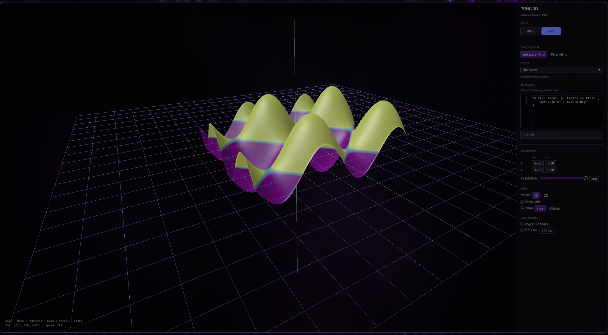
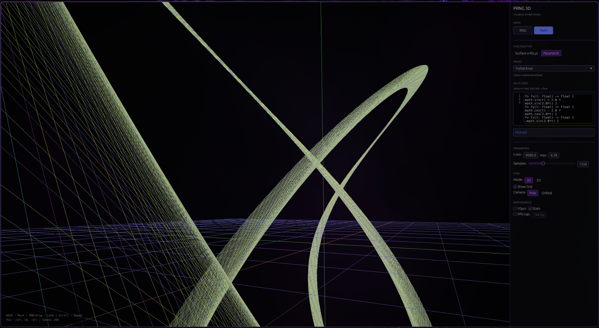

# PRNG3D

GPU-accelerated visualizer for PRNGs and mathematical surfaces

<p align="center">
  
  
  
</p>

### Visualizer

Two modes :

- **PRNG** : renders point clouds from custom RNG code, either in 3D or as a 2D heatmap. Good for spotting correlation patterns in generator output (try RANDU to see what bad looks like).
- **Math Plotter** : renders surfaces, parametric curves, parametric surfaces

Functions are written in [Aelys](https://github.com/vbxq/aelys_lang), my own language, and compiled at runtime.
There's also some built-in examples: Xorshift32, LCG MINSTD, RANDU (intentionally broken), sine wave, saddle, torus, helix, trefoil knot, and a few others.

### Build and run
```bash
cargo run --release
```

### Why
It is mostly dogfooding, using Aelys in a real visualizer quickly shows what works and what does not.  
If something is awkward to write or behaves unexpectedly here, it is usually a sign that Aelys itself needs work.

### License

BSD 3-Clause License.
Read [LICENSE](LICENSE) for details.
